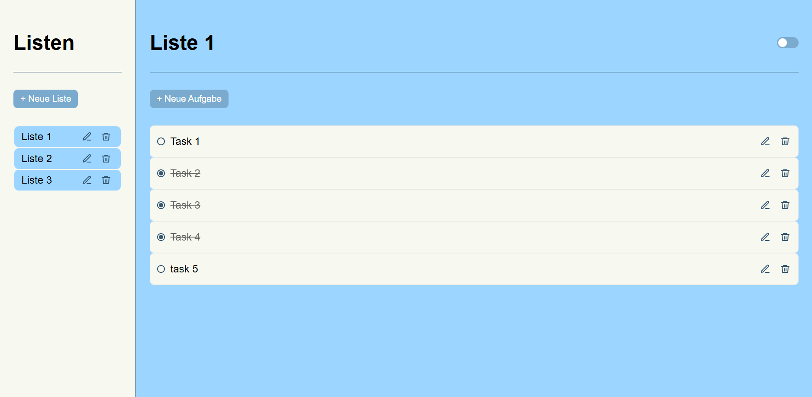
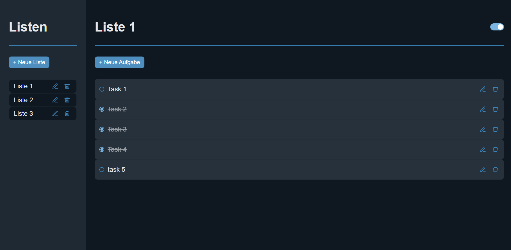

# 📝 Todo App

A modern, modular Todo application with multi-list management and persistent dark mode.

Built with Vanilla JavaScript (ES Modules) and structured with a clean, modular architecture.

## 🌐 Live Demo
👉 https://miam0316.github.io/todo-app/

---

## 🚀 Features

### 📂 List Management

- Create new lists
- Inline editing of list names
- Delete lists
- Select active list

### ✅ Task Management

- Add tasks to a specific list (inline input)
- Toggle tasks (done / undone)
- Inline editing of tasks
- Delete tasks

### 🌙 Dark Mode

- Toggle switch (top right)
- Theme stored in LocalStorage
- Persistent theme after reload

---

## 🛠️ Tech Stack

- Vanilla JavaScript (ES Modules)
- HTML5
- CSS3
- LocalStorage (for persistence)

---

## 🧠 Technical Highlights

- Modular file structure
- Clear separation of state management and UI logic
- Dynamic DOM rendering
- Event handling with `stopPropagation`
- Inline editing via `keydown` and `blur`
- Guard logic to prevent duplicate state updates
- Dark Mode implemented using CSS Custom Properties

---

## 📸 Screenshots

### Light View

<p align="center">
  
</p>

### Dark Mode

<p align="center">
  
</p>

---

## 💡 Possible Extensions

- Drag & Drop sorting
- Task priorities
- Due dates
- Filtering (All / Active / Completed)
- Animations
- Backend integration

---

## ▶️ Run Locally

Clone the repository:

```bash
git clone https://github.com/MiaM0316/todoapp.git
```
